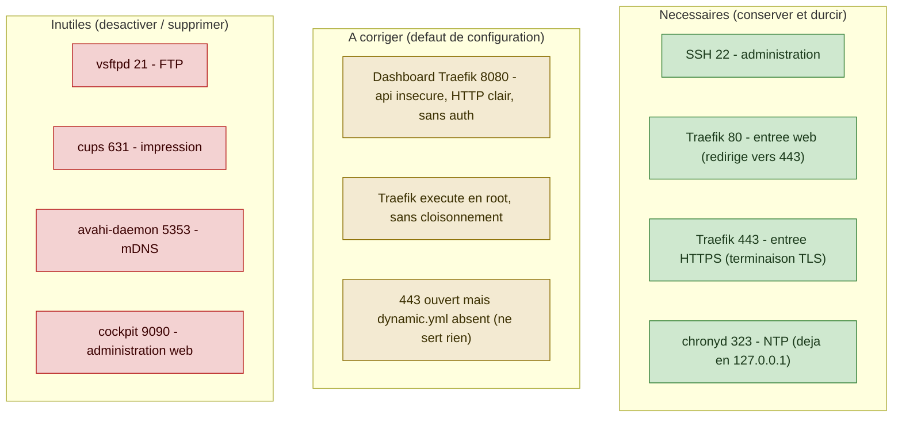
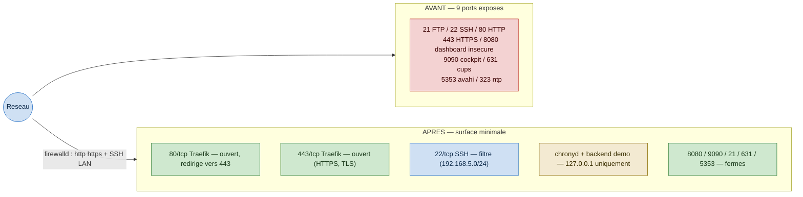
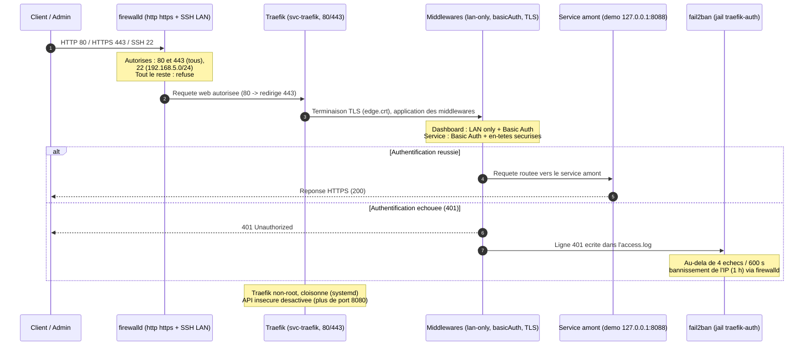

**Sécurité des systèmes d'exploitation et des réseaux**

# Travail pratique n° 4
## Analyse et durcissement d'un reverse proxy Linux

| | |
|---|---|
| **Système cible** | Reverse proxy Traefik (AlmaLinux 10.2) |
| **Document** | Note de synthèse |
| **Auteur** | Raian Remir |
| **Date** | Juin 2026 |
| **Version** | 1.0 |
| **Diffusion** | Usage pédagogique |

---

## 1. Objet du document

Ce dossier présente l'analyse de la surface d'attaque et le durcissement d'un
serveur assurant le rôle de **reverse proxy Traefik**, point d'entrée web du campus,
sous **AlmaLinux 10.2**. À la différence d'un système obsolète, la machine est
récente et supportée jusqu'en 2035 : l'objectif n'est pas de corriger des versions
non maintenues, mais de **réduire une surface d'attaque excédant le rôle** et de
**corriger des défauts de configuration**, en priorité l'exposition du tableau de
bord d'administration et l'exécution du proxy avec les privilèges du superutilisateur,
tout en préservant la fonction de reverse proxy.

## 2. Contexte technique

AlmaLinux 10 s'appuie sur systemd, firewalld (zones, services, règles enrichies) et
SELinux en mode *enforcing*. Traefik est déployé en binaire natif
(`/usr/local/bin/traefik`), piloté par une unité systemd et configuré par deux
fichiers : `traefik.yml` (configuration statique) et `dynamic.yml` (routeurs,
services, terminaison TLS). La protection contre les tentatives d'authentification
répétées repose sur fail2ban. L'énumération s'appuie sur `ss`, `systemctl`,
`firewall-cmd`, `sestatus` et `fail2ban-client`.

## 3. Composition du dossier

| Élément | Description |
|---|---|
| `01_analyse.md` | Cartographie du système et analyse de la surface d'attaque |
| `02_plan_durcissement.md` | Plan de durcissement (état initial, mesures, vérification, état final) |
| `diagrams/` | Sources des schémas au format Mermaid |
| `captures/` | Captures d'écran (preuves visuelles) et guide d'acquisition |

## 4. Synthèse des mesures appliquées

| N° | Mesure | Incidence sur le service |
|---|---|---|
| 1 | Sécurisation du tableau de bord (HTTPS, authentification, accès restreint au réseau d'administration), fermeture du port 8080, création de la configuration dynamique, redirection HTTP vers HTTPS | Reverse proxy rendu fonctionnel |
| 2 | Exécution de Traefik sous le compte non privilégié `svc-traefik` (capacité `CAP_NET_BIND_SERVICE` pour les ports inférieurs à 1024) | Aucune |
| 3 | Cloisonnement systemd du service (système de fichiers en lecture seule, restriction des appels système, mémoire non exécutable, isolation du noyau) | Aucune |
| 4 | Suppression des services superflus (FTP, impression, mDNS, administration web) | Aucune |
| 5 | Gestion des comptes et des privilèges (retrait des élévations sans mot de passe, verrouillage des comptes superflus, nettoyage du groupe d'administration et des règles sudo) | Aucune |
| 6 | Filtrage réseau (autorisation des seuls flux web, restriction de SSH au réseau d'administration) | Aucune |
| 7 | Durcissement de SSH (authentification par clé exclusive, interdiction du superutilisateur) | Administration par clé |
| 8 | Protection contre le bruteforce (durcissement de la surveillance SSH et activation d'une surveillance du proxy) | Service de démonstration authentifié |

La surface réseau passe de **neuf ports exposés** — dont un tableau de bord
d'administration accessible sans authentification — à **trois ports nécessaires**
(22, 80, 443). Le proxy s'exécute désormais sous un compte non privilégié et
cloisonné, et assure réellement sa fonction (terminaison TLS et routage).

## 5. Schémas

Les sources éditables figurent dans le dossier `diagrams/`.

### 5.1 Services nécessaires, superflus et défauts à corriger

### 5.2 Ports exposés avant et après durcissement

### 5.3 Flux d'une requête après durcissement

## 6. Périmètre et limites

Deux limites sont assumées et documentées dans le plan de durcissement. D'une part,
le contexte SELinux du processus Traefik demeure `unconfined_service_t` : un
confinement SELinux fin nécessiterait une politique dédiée, le binaire résidant hors
des emplacements standard couverts par la politique *targeted*, ce qui dépasse le
périmètre du présent travail ; l'isolation reste néanmoins assurée par l'abandon des
privilèges du superutilisateur et le cloisonnement systemd. D'autre part, le
certificat de terminaison TLS est auto-signé et de courte validité : une mise en
production imposerait un certificat reconnu, émis par une autorité (ACME / Let's
Encrypt) ou par une infrastructure à clés publiques interne.

